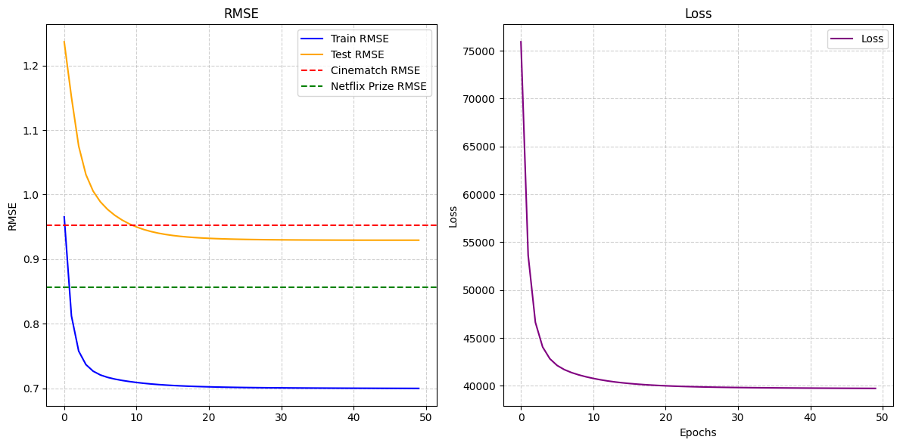

<p align="center">
  
  <span style="font-size: 24px; font-weight: bold; margin: 0 10px;">⟷</span>
  
</p>

<p align="center"><strong>Python ↔ C++ Integration</strong><br/>
<em>Powered by <a href="https://pybind11.readthedocs.io/" target="_blank">pybind11</a></em>
</p>


<p align="center">
  <a href="https://git.io/typing-svg"></a>
</p>


# Flash Recommender System

<p align="center">
  
  
</p>

<p align="center">
  <strong>C++ Dependencies</strong><br/>
  
  
  
  
</p>

<p align="center">
  <strong>Python Dependencies</strong><br/>
  
</p>

<p align="center">
  <a href="https://www.codacy.com/manual/p-ranav/indicators?utm_source=github.com&amp;utm_medium=referral&amp;utm_content=p-ranav/indicators&amp;utm_campaign=Badge_Grade">
    
  </a>
  <a href="https://github.com/p-ranav/indicators/blob/master/LICENSE">
    
  </a>
</p>

----

The Flash Recommender System is a high-performance, scalable recommendation engine powered by cpp backend to the heavy lifting of training Alternating Least Squares (ALS) matrix factorization. It is the fastest implementation training a recommender system with ALS.

---

## Features
- Compiled with Clang LLVM’s optimisations - aggressive inlining, loop unrolling, auto-vectorisation, ... 
- cpp backend uses Eigen, a highly optimised library for matrix algebra — fast Cholesky decomposition and other linear algebra routines.
- OpenMP threading for parallelism, enabling shared-memory multithreading with dynamic workload balancing.


## Installation
**🏗️ CLI UI still under construction**  
this is how to use ... 

your system needs `python3-dev git-lfs cmake unzip axel` and a compiler with LLVM toolchain `sudo [pkg] install clang lldb lld libomp-dev` 
1. **Clone the repository:** 
    ```bash
    git clone --recurse-submodule https://github.com/soot-bit/MovieRecommender.git
    git lfs pull
    pip install -U "pybind11[global]" tqdm optuna
    ```

2. run `$ source build.sh`
2. **Train the model or load trained matrices and vectors for making predictions:**
3. **Make predictions:**


to download the the full datasets yourself Million Users large data set run bypass `git lfs pull`
```bash
$ > ./download_ds.sh
```
example usage
```
time python main.py  --dataset "ml-latest-small"
```
add flag `--flash` for flash training. you might not think anything happened but it did train
add flag `---plot` to confirm if indead it did exectute.


<div align="center">


<!-- 
`pip install flash-rec --upgrade`


```python

import flash_rec as fr

# Blazing-fast recommendations in 3 lines!
model = fr.HyperEngine()
model.train(lightning_mode=True) ## uses cpp backend
recommendations = model.predict(user_id=42, top_k=10)

``` -->


###  Benchmarks

| Operation               | Python 🐢 + NumPy | Flash System ⚡ | Speed-up      |
|------------------------|------------------|-----------------|---------------|
| Matrix Factorization   | -                | -               | ***100.1×***  |
| Recommendation Batch   | -                | -               | **2005.7×**   |

*to be done properly*




</div>

## **Recipies**


<div style="text-align: left;">

### Using [`DataIndx`](./src/data.py)

This class provides a very efficient way to index and preprocess user-movie ratings data for training recommendation models ALS.  
It has:
- very clever memory management to avoid duplicating snapTensor  
- Data loading and index mappings for users/movies  
- Feature engineering for movies  
- Train-test splitting with per-user stratification  
- *O(1)* retrieval of user/movie ratings  
- efficient sampling of per-user ratings using sklearn `train_test_split`

**arg:**
- `dataset`: the path to the data("ml-latest" 25 M or "ml-latest-small" 100K)

</div>


**Initialization**

```python
from src.data import DataIndx  

# Load dataset (e.g., ml-latest or ml-latest-small)
data = DataIndx("ml-latest", cache=True)
```
<div style="text-align: left;">
By default, this will:

- Load the dataset from `Data/ml-latest/`
- Create user/movie ID mappings
- Perform a stratified train/test split
- Caches all processed data to disk (cache only the large dataset) 


You can access core components of the class after initialization:

```python
print(data.ratings.head())         # Raw ratings DataFrame
print(len(data.idx_to_user))       # Total number of unique users
print(len(data.idx_to_movie))      # Total number of unique movies

# Get internal tensor for ALS training
tensor = data.snap_tensor
```

The tensor has methods:
- `.add_train(user_idx, movie_idx, rating)`
- `.add_test(user_idx, movie_idx, rating)`
- Use with your ALS trainer directly


 **🏷️ Get Movie Features**

```python
movie_id = 123
features = data.get_features(movie_id)
print(features)

# Output example:
# {
#     'title': 'Toy Story (1995)',
#     'genres': ['Animation', 'Children', 'Comedy'],
#     'tags': ['Pixar', 'funny', 'great animation']
# }
```


The Data directory should look something like..
```
Data/
└── ml-latest/
    ├── ratings.csv
    ├── movies.csv
    └── tags.csv
```
</div>


<div align="center"><details>
<summary><h3>🧠 ALS algorithm</h3></summary>
  

- Update $U \rightarrow V \rightarrow b_i \rightarrow b_j$ iteratively.
 
 **User Vector**
$u_i = \left( \lambda \sum_{j \in \Omega(i)} v_j v_j^T + \tau I \right)^{-1} \left( \lambda \sum_{j \in \Omega(i)} (r_{ij} - b_i - b_j) v_j \right)$

   **Movie Vector**
   $v_j = \left( \lambda \sum_{i \in {\Omega}^{-1}(j)} u_i u_i^T + \tau I \right)^{-1} \left( \lambda \sum_{i \in {\Omega}^{-1}(j)} (r_{ij} - b_i - b_j) u_i \right)$


   **User Bias**
   $b_i = \frac{\lambda \sum_{j \in \Omega(i)} \left(r_{ij} - u_i^T v_j - b_j\right)}{\lambda |\Omega(i)| + \gamma}$

  **Movie Bias**
   $b_j = \frac{\lambda \sum_{i \in {\Omega}^{-1}(j)} \left(r_{ij} - u_i^T v_j - b_i\right)}{\lambda |{\Omega}^{-1}(j)| + \gamma}$


##### **Key Notes:**

- **Interdependence**: Biases $b_i$ and $b_j$ depend on each other, so update them sequentially using the most recent values and split updates
- **Regularization**: $\gamma$ controls the strength of bias regularization. $\tau$ controls strength of latent vec regularisation

</details>


<div align="center">

  [](https://github.com/yourusername)
  [](https://opensource.org/)

</div>


